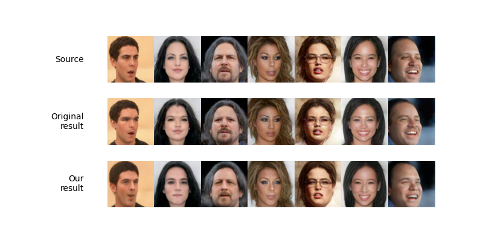

# Face Image De-Identification By Feature Space Adversarial Perturbation - Unofficial PyTorch Implementation
<a href="https://opensource.org/licenses/MIT"></a>  
       

<p align="center">

<br>
The proposed re-implementation can de-identify face images using adversarial perturbations in the feature space. The top row represents source images, the middle row shows results shown in the original paper, and the last row shows the results of our re-implementation. 
</p>
> Privacy leakage in images attracts increasing concerns these days, as photos uploaded to large social platforms are usually not processed by proper privacy protection mechanisms. Moreover, with advanced artificial intelligence (AI) tools such as deep neural network (DNN), an adversary can detect people's identities and collect other sensitive personal information from images at an unprecedented scale. In this paper, we introduce a novel face image de‐identification framework using adversarial perturbations in the feature space. Manipulating the feature space vector ensures the good transferability of our framework. Moreover, the proposed feature space adversarial perturbation generation algorithm can successfully protect the identity‐related information while ensuring the other attributes remain similar. Finally, we conduct extensive experiments on two face image datasets to evaluate the performance of the proposed method. Our results show that the proposed method can generate real‐looking privacy‐preserving images efficiently. Although our framework has only been tested on two real‐life face image datasets, it can be easily extended to other types of images.

## Description   
Unnoficial implementation of [Face Image De-Identification By Feature Space Adversarial Perturbation](https://onlinelibrary.wiley.com/doi/epdf/10.1002/cpe.7554) with Pytorch


## Getting Started
### Installation
- Clone this repo:
``` 
git clone https://github.com/azimIbragimov/face-image-de-identification.git
cd face-image-de-identification
```
- Dependencies:  
We recommend running this repository using [Docker](//www.docker.com/) and [NVIDIA Container Toolkit](https://docs.nvidia.com/datacenter/cloud-native/container-toolkit/latest/install-guide.html).
 
All dependencies for defining the environment are provided in the Dockerfile

Once you have installed Docker on your system, run the following CLI commands to install the image:

`
docker build -t face-image-de-identification .
`

Congratulations, you have installed the image. Each time you want to access the image, run th following command

`
docker run --gpus all -v ./workspace -it face-image-deidentification
cd /workspace
`


### Required pretrained Models
Please download the pre-trained models from the following links. Each pSp model contains the entire pSp architecture, including the encoder and decoder weights.
| Path | Description
| :--- | :----------
|[StyleGAN Inversion](https://drive.google.com/file/d/1bMTNWkh5LArlaWSc_wa8VKyq2V42T2z0/view?usp=sharing)  | pSp trained with the FFHQ dataset for StyleGAN inversion.
|[ArcFace Resnet](https://onedrive.live.com/?authkey=%21AFZjr283nwZHqbA&cid=4A83B6B633B029CC&id=4A83B6B633B029CC%215650&parId=4A83B6B633B029CC%215581&o=OneUp) | Backbone ArcFace Resnet 50 model

Note: You must place these models in the root directory (In other words, place the model in the same folder where `Dockerfile` is located).

## Inference
We define the following interface to interact with the codebase. 
For example, 
```
python inference.py \
	--img /path/to/img.png # Note: Image file can have any extension (.png, .jpg, .jpeg, .bmp, ...)
	--id_loss 0.8 # range [0, 2]
	--out /path/to/output.png
```


## Credits
**Pixel2Style2Pixel implementation:**
https://github.com/eladrich/pixel2style2pixel
Copyright (c) 2020 Elad Richardson, Yuval Alaluf
License (MIT) https://github.com/rosinality/stylegan2-pytorch/blob/master/LICENSE

**InsightFace Resnet 50 implementation:**
https://github.com/deepinsight/insightface


**StyleGAN2 implementation:**  
https://github.com/rosinality/stylegan2-pytorch  
Copyright (c) 2019 Kim Seonghyeon  
License (MIT) https://github.com/rosinality/stylegan2-pytorch/blob/master/LICENSE  

**MTCNN, IR-SE50, and ArcFace models and implementations:**  
https://github.com/TreB1eN/InsightFace_Pytorch  
Copyright (c) 2018 TreB1eN  
License (MIT) https://github.com/TreB1eN/InsightFace_Pytorch/blob/master/LICENSE  

**CurricularFace model and implementation:**   
https://github.com/HuangYG123/CurricularFace  
Copyright (c) 2020 HuangYG123  
License (MIT) https://github.com/HuangYG123/CurricularFace/blob/master/LICENSE  

**Ranger optimizer implementation:**  
https://github.com/lessw2020/Ranger-Deep-Learning-Optimizer   
License (Apache License 2.0) https://github.com/lessw2020/Ranger-Deep-Learning-Optimizer/blob/master/LICENSE  

**LPIPS implementation:**  
https://github.com/S-aiueo32/lpips-pytorch  
Copyright (c) 2020, Sou Uchida  
License (BSD 2-Clause) https://github.com/S-aiueo32/lpips-pytorch/blob/master/LICENSE  

## Citation
```
@article{xue2023face,
  title={Face image de-identification by feature space adversarial perturbation},
  author={Xue, Hanyu and Liu, Bo and Yuan, Xin and Ding, Ming and Zhu, Tianqing},
  journal={Concurrency and Computation: Practice and Experience},
  volume={35},
  number={5},
  pages={e7554},
  year={2023},
  publisher={Wiley Online Library}
}
```


```
@InProceedings{richardson2021encoding,
      author = {Richardson, Elad and Alaluf, Yuval and Patashnik, Or and Nitzan, Yotam and Azar, Yaniv and Shapiro, Stav and Cohen-Or, Daniel},
      title = {Encoding in Style: a StyleGAN Encoder for Image-to-Image Translation},
      booktitle = {IEEE/CVF Conference on Computer Vision and Pattern Recognition (CVPR)},
      month = {June},
      year = {2021}
}
```
